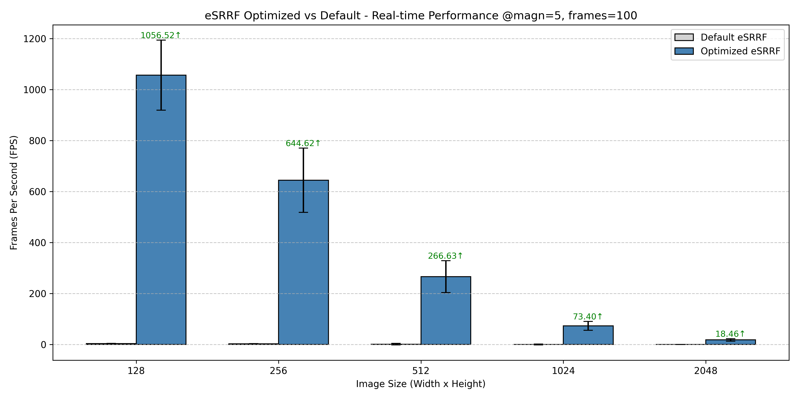
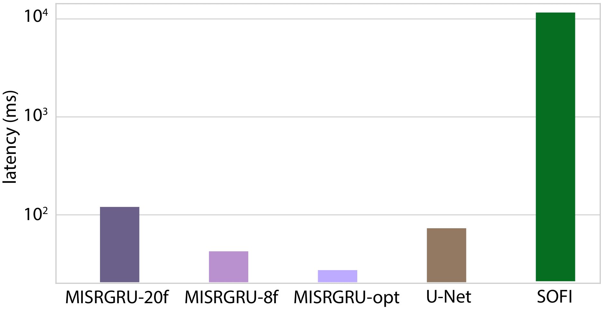
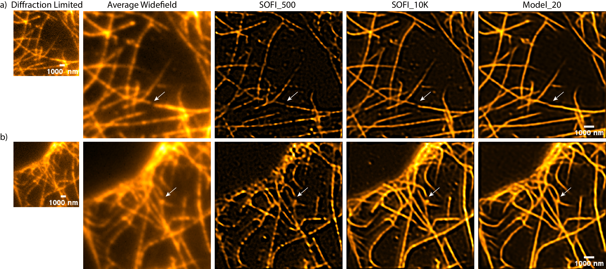

# Software/Machine Learning Engineer
A biotech enthusiast.

#### Technical Skills: ML, DL, Image Processing, Embedded Systems, Software Architecture, Fluorescence Microscopy
#### Programming Langueges: Python, C/C++, CUDA, Rust, MATLAB, Java, VHDL

## Education
- MSc., Embedded and Computer Engineering | TU Delft (_October 2024_)
- BSc., Electrical Engineering | Inholland Alkmaar (_July 2022_)

## Work Experience
**Research Scientist @ TU Delft | Grussmayer Lab (_Januari 2025 - Present_)**
- Developed a **[Focus Lock](https://ir.amolf.nl/pub/10774/16893publishedVersion.pdf)** system to correct for lateral drift by adjusting the axial position of the microscope, enabling stable live-cell and single-molecule imaging. [Repo](https://github.com/GrussmayerLab/gFocus).
- Contributed to the development of **Fast [SOFI](https://en.wikipedia.org/wiki/Super-resolution_optical_fluctuation_imaging)** (Super-resolution Optical Fluctuation Imaging) using deep learning, with the goal of enabling real-time imaging in live-cell applications. Ultimately, the model reconstructs super-resolved images from just 8 low-resolution frames, achieving a two-fold improvement in spatial resolution. [Repo](https://github.com/GrussmayerLab/SOFI-MISRGRU) soon public!
- Supporting the preparation of a **scientific publication** based on prior contributions to deep-learning-based SOFI acceleration during MSc research.
- Presented the work at two conferences: SMLMS Lisbon and NWO Biophysics. 

**Software Engineer @ VU Amsterdam | Electronics Group (_August 2022 - Present_)**
- Co-developing **LabOrch**, a Python-based lab orchestrator designed to control scientific instrumentation through a modular microservices architecture. Enables seamless integration of diverse lab devices with unified control, real-time feedback, metadata handling, and a logging API layer.
- Developed the embedded software architecture for the **Line Controller**, an industrial Ethernet (Modbus-based) device used to control scientific instrumentation via various digital and analog hardware interfaces.

**Intern Electronics Engineer @ LUMICKS (_Februari 2022 - June 2022_)**
-  Designed an FPGA-based demo system for the C-Trap [optical tweezer](https://en.wikipedia.org/wiki/Optical_tweezers) to explore integration of beam steering (Piezo, EOD, AOD) and force sensing (PSDs, sCMOS) using a high-bandwidth PID control loop.

## Projects
### Real-Time eSRRF
To sharpen my CUDA programming skills, I optimized [eSRRF](https://www.nature.com/articles/s41592-023-02057-w) (enhanced super-resolution radial fluctuations), an super-resolution algorithm that analyzis the radial intensity fluctuations in fluorescent images to compute a super-resolved image, as a personal project. eSRRF is widely used in live-cell super-resolution microscopy. However, its high computational cost limits its use as a real-time imaging that would allow users to tweak microscope settings on the fly and save valuable time. 

I re-implemented the algorithm in C and further optimized it using CUDA. While the core structure remains the same, I replaced the original temporal analysis—which waits for n frames before generating a result—with incremental versions of AVG, VAR, and TAC2. Unlike the default approach, which recomputes statistics over the full window each time, the incremental method updates values efficiently as new frames arrive. This significantly reduces computational overhead and memory usage, enabling continuous frame-by-frame output at the camera’s frame rate while maintaining the same temporal resolution (n). As a result, the system produces super-resolved images in real time—paving the way for on-the-fly microscope tuning, real-time modality switching, high-throughput phenotyping, and integration with statistical or machine learning pipelines.

The plot below compares the performance of the optimized and default eSRRF implementations in terms of frames per second (FPS) across different image sizes. The optimized version supports real-time super-resolution imaging even at full field of view (FOV): for 2048×2048 images, it achieves 18 FPS, and for 1024×1024 images, up to 73 FPS. These benchmarks were run on an NVIDIA RTX 3090, with eSRRF parameters set to: magnification = 5, radius = 2, sensitivity = 1, weighting = 1, and temporal type = TAC2.

The video below demonstrates live-cell HiLO-TIRF imaging of COS-7 cells using the optimized eSRRF implementation. Tip: Scroll through the video to observe dynamic structural changes!

<video class="responsive-video" controls>
  <source src="/assets/output_res.mp4" type="video/mp4">
  Your browser does not support the video tag.
</video>

### Fast SOFI
To accelerate fluctuation-based super-resolution imaging, I adapted and trained [MISGRU](https://openaccess.thecvf.com/content_CVPRW_2020/papers/w11/Arefin_Multi-Image_Super-Resolution_for_Remote_Sensing_Using_Deep_Recurrent_Networks_CVPRW_2020_paper.pdf)—a recursive neural network originally designed for remote sensing—as part of my master’s thesis. These types of super-resolution techniques, like SOFI (super-resolution optical fluctuation imaging), analyze temporal intensity fluctuations in fluorescence microscopy to recover sub-diffraction detail. However, they typically require hundreds of frames and intensive post-processing to generate a single image, making them unsuitable for real-time applications.

MISGRU addresses both limitations. It takes a short sequence of low-resolution frames and integrates spatio-temporally correlated blinking signals to predict a super-resolved image. I trained the network using second-order SOFI reconstructions as the target, but with only 8-frame inputs. The goal was to retain the spatial benefits of SOFI while massively reducing latency and frame requirements.

After optimizing the model architecture and inference pipeline, MISGRU outputs second-order super-resolved images at latencies as low as 27 ms—a 400× speedup over the SOFI baseline—while preserving the same twofold spatial resolution improvement. This brings us closer to real-time live-cell super-resolution imaging, with a temporal resolution of just 8 frames per image.

The figure below compares 20-frame MISRGRU reconstructions with SOFI outputs using up to 10,000 frames in DNA-PAINT microtubule data. From left to right: a single diffraction-limited frame, a 20-frame average upsampled with bilinear interpolation, SOFI with 500 frames, SOFI with 10k frames, and MISRGRU with just 20 frames.

An 8-frame version is coming soon! Initially, we used 20 frames as a solid starting point, but 8 frames strikes a better balance between temporal resolution and overall image quality. Still, this gives a good impression of how MISRGRU performs on real data.

White arrows mark regions where MISRGRU reconnects filaments that appear broken in the widefield average—demonstrating clear structural recovery at drastically lower frame counts.
Scale bar: 1000 nm.

## Publications
### Fast SOFI
Coming up.

### gFocus
Coming up.
